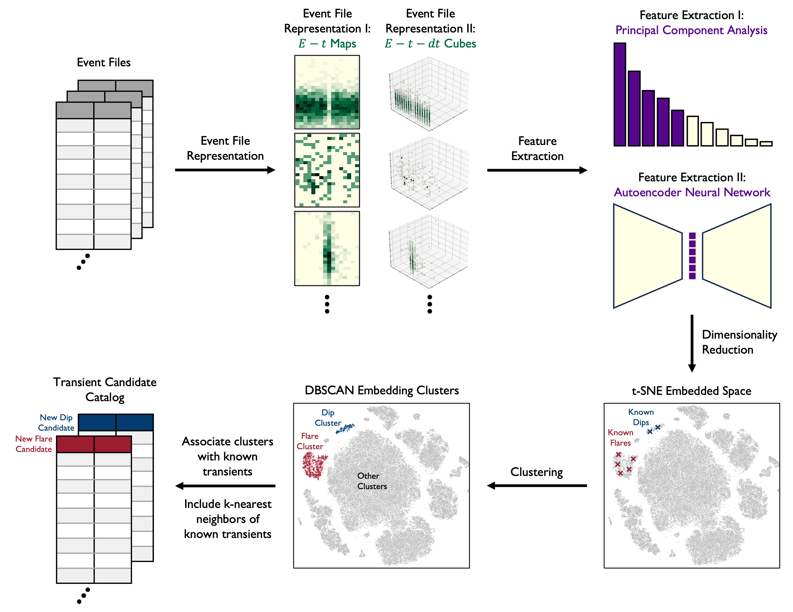

# Data Driven Discovery of X-ray Transients with Machine Learning: A Representation Learning Approach for Anomaly Detection

[](https://arxiv.org/abs/2101.00001)
[](https://opensource.org/licenses/MIT)


## Description
This is the official repository and implementation associated with the paper **Data Driven Discovery of X-ray Transients with Machine Learning: A Representation Learning Approach for Anomaly Detection (Dillmann et al. 2024)**.



We present novel event file representations and the first representation learning based anomaly detection approach for the discovery of high-energy transients.
This involves extracting features from the representations using principal component analysis or an autoencoder followed by dimensionality reduction and clustering. By associating these clusters with previously identified transients and performing nearest-neighbor searches, we create a catalog of X-ray transient candidates. This novel transient detection method for time-domain high-energy astrophysics is applicable to data from other high-energy observatories like XMM-Newton, Swift XRT, eROSITA and the Einstein Probe.

We denote the embedding results from the different event file representations and feature extractions as in the table below.

| Case | Event File Representation | Feature Extraction |
|----------|----------|----------|
| $2D-PCA$    | $E-t$ Maps (not normalized)    | Principal Component Analysis (15 components)     |
| $3D-PCA$    | $E-t-dt$ Cubes (not normalized)   | Principal Component Analysis (22 components)       |
| $2D-AE$    | $E-t$ Maps (normalized)    | [Autoencoder, convolutional](encoders/encoder_et.h5) (12 latent features)   |
| $3D-AE$    | $E-t-dt$ Cubes (normalized)    | [Autoencoder, fully-connected](encoders/encoder_etdt.h5) (24 latent features)    |

## Table of Contents
- [Data Availability](#data-availability)
- [Installation](#installation)
- [Usage](#usage)
- [Support](#support)
- [License](#license)
- [Project Status](#project-status)
- [Authors and Acknowledgment](#authors-and-acknowledgment)

## Data Availability

We provide the project datasets in this [Google Drive Folder](https://drive.google.com/drive/folders/1LQNyM4in2RsOtEmxdh4u8viPY2fek9-3?usp=sharing). It includes the following folders and files:

### `datasets` Folder

This folder includes the input data for the transient detection pipeline and additional event file properties. Include these files in the `ml-xraytransients/datasets` directory, if you want to reproduce the published results from scratch.

- `eventfiles_table.csv`: A table including all event files used in this project. To filter for a single eventfile use the *obsreg_id* column. 
- `properties_table.csv`: A table listing the variability and hardness ratio properties for all eventfiles, retrieved from the Chandra Source Catalog.
- `properties_full_table.csv`: A table listing further properties for all eventfiles, retrieved from the Chandra Source Catalog.
- `bonafide_transients.json`: A directory listing the *obsreg_id* ID for the event files from the bona-fide transients used in this project. Each key corresponds to a different type of transient and can be customized. 


### `output/embeddings` Folder

This folder includes the final output data of the transient detection pipeline with the hyperparameters outlined in the paper. Include these files in the `ml-xraytransients/output/embeddings` directory, if you want to use the embedding results described in the paper. 

- `paper2DAE_embedding.csv`: The t-SNE embedding of the autoencoder features of the $E-t$ Maps. 
- `paper2DAE_clusters.csv`: The t-SNE embedding of the autoencoder features of the $E-t$ Maps (including DBSCAN clusters).
- `paper2DPCA_embedding.csv`: The t-SNE embedding of the PCA features of the $E-t$ Maps.
- `paper2DPCA_clusters.csv`: The t-SNE embedding of the PCA features of the $E-t$ Maps (including DBSCAN clusters).
- `paper3DAE_embedding.csv`: The t-SNE embedding of the autoencoder features of the $E-t-dt$ Cubes. 
- `paper3DAE_clusters.csv`: The t-SNE embedding of the autoencoder features of the $E-t-dt$ Cubes (including DBSCAN clusters).
- `paper3DPCA_embeddings.csv`: The t-SNE embedding of the PCA features of the $E-t-dt$ Cubes.
- `paper3DPCA_clusters.csv`: The t-SNE embedding of the PCA features of the $E-t-dt$ Cubes (including DBSCAN clusters).


## Installation

### Requirements

To get started with this project, ensure your system meets the following requirements:

- **Python:** Version 3.9 or higher must be installed on your system.
- **Conda:** This is used for managing the Python environment.
- **Keras (TensorFlow):** Version 2.12.0 or higher required for utilizing neural networks.


### Setup

To setup the project environment and install the corresponding dependencies, use the following commands:

```bash
conda create --name [new_env] python=3.9
conda activate [new_env]
pip install --upgrade pip
pip install -r requirements.txt
```

where `[new_env]` is your chosen environment name.

## Usage

The following commands are to be executed from the `../src` directory.

### Event File Representation

Run the following scripts to generate the event file representations:

- $E-t$ Maps (normalized):

```bash
python run_eventfile_representation.py '../datasets/eventfiles_table.csv' 'et'
```

- $E-t$ Maps (not normalized):

```bash
python run_eventfile_representation.py '../datasets/eventfiles_table.csv' 'et' -norm False
```

- $E-t-dt$ Cubes (normalized):

```bash
python run_eventfile_representation.py '../datasets/eventfiles_table.csv' 'etdt'
```

- $E-t-dt$ Cubes (not normalized):

```bash
python run_eventfile_representation.py '../datasets/eventfiles_table.csv' 'etdt' -norm False
```

### Feature Extraction 

Run the following scripts to extract features from the eventfile representations:

- $2D-PCA$ Case:
```bash
python run_feature_extraction.py '../output/representations/et_16-24_normFalse_representations.pkl.' 'PCA' 15
```

- $3D-PCA$ Case:
```bash
python run_feature_extraction.py '../output/representations/etdt_16-24-24_normFalse_representations.pkl.' 'PCA' 22
```

- $2D-AE$ Case:
```bash
python run_feature_extraction.py '../output/representations/et_16-24_normTrue_representations.pkl.' '../encoders/encoder_et.h5'
```

- $3D-AE$ Case:
```bash
python run_feature_extraction.py '../output/representations/etdt_16-24-24_normTrue_representations.pkl.' '../encoders/encoder_etdt.h5'
```

### Dimensionality Reduction

Run the following script to perform dimensionality reduction on the extracted features:

```bash
python run_dimensionality_reduction.py <feature_path> [-n n_components] [-p perplexity] [-lr learning_rate] [-iter n_iter] [-exag early_exaggeration] [-init init] [-rs random_state]
```

where `<feature_path>` is the path to the chosen feature set and the rest of the inputs are the t-SNE algorithm hyperparameters.

### Embedding Clustering

Run the following script to perform cluster on the embeddings:

```bash
python run_embedding_clustering.py <embedding_path> [-eps eps] [-ms min_samples]
```

where `<embedding_path>` is the path to the chosen feature embedding and the rest of the inputs are the DBSCAN algorithm hyperparameters.

### Demonstration Notebook

A demonstration of the pipeline is available in the Jupyter Notebook [demo.ipynb](src/demo.ipynb). This notebook also includes a tool to identify analogs to bona-fide transients defined in the [datasets/bonafide_transients.json](datasets/bonafide_transients.json):


## Support
For any questions, feedback, or assistance, please feel free to reach out via email at [stevendi@stanford.edu](stevendi@stanford.edu).

## License
This project is licensed under the [MIT License](https://opensource.org/license/mit/).

## Project Status
The project is in a state ready for submission. All essential features have been implemented, and the codebase is stable. Future updates may focus on minor improvements, bug fixes, or optimizations.

<!-- ## Citation
@article{Dillmann_2024,
   title={Data Driven Discovery of X-ray Transients with Machine Learning: A Representation Learning Approach for Anomaly Detection},
   volume={531},
   ISSN={1365-2966},
   url={http://dx.doi.org/10.1093/mnras/stae1450},
   DOI={10.1093/mnras/stae1450},
   number={4},
   journal={Monthly Notices of the Royal Astronomical Society},
   publisher={Oxford University Press (OUP)},
   author={Dillmann, Steven and Martínez-Galarza, Rafael and Soria, Roberto and Di Stefano, Rosanne and Kashyap, Vinay L.},
   year={2024},
   month=jun, pages={XXXX–XXXX} } -->

## Authors and Acknowledgment
Many thanks to the following contributors:

- Steven Dillmann, Stanford University
- Rafael Martínez-Galarza, Center for Astrophysics | Harvard & Smithsonian
- Rosanne Di Stefano, Center for Astrophysics | Harvard & Smithsonian
- Roberto Soria, Italian National Institute for Astrophysics (INAF)
- Vinay Kashyap, Center for Astrophysics | Harvard & Smithsonian

This project is maintained by [Steven Dillmann](https://www.linkedin.com/in/stevendillmann/). 

1st September 2024